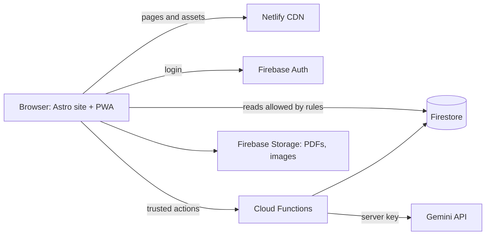

# Review notes

Hi,

I went through the whole repo (commit `edb5e63`). There's a lot here: teacher pages, quizzes with AI explanations, chat, a periodic table, push notifications and a PWA. Nice effort. Below is what I'd change, most important first. Line numbers are from `edb5e63`.

## What's good
- The CSS variables at the top of `index.html` are a good start. Use the same idea on every page.
- The `/__/auth/*` rewrite in `_redirects` is the right way to run Firebase login on your own domain.
- `sw.js` clears old caches and falls back to `offline.html`. Good instinct.
- `escapeHtmlDash()` in the dashboard is exactly what the rest of the code needs.

## 1. Fix first: main is broken
The live site still runs an older deploy, so it looks fine right now. The next deploy from `main` will ship everything below.

- `history.js` now contains a full HTML page (commit `2c27da2`). Six teacher pages load it as a script, so the menu and back buttons stop working. Restore the old version from `0b38a0a`.
- `quiz/quiz.js` is also an HTML file, not JavaScript.
- `quiz/quizzes.html` was deleted, but the dashboard, quiz list, results page and test series still link to it. Every "Start quiz" button will go to a 404.
- `quiz/dashboard.html:715` is missing a `}`. It was removed together with a comment, so the whole dashboard script fails. `ANSWER_LOOKUP_CAP` (line 854) is also never defined.
- `sw.js` caches `/pictures/neelaxmi.jpg`, but the file is `.png`. Because of this the service worker never installs and offline mode doesn't work. `manifest.json` uses the same wrong icon, and `start_url` should be `/`, not `Index.html`.
- Most pages load `/js/head-loader.js`, which isn't in the repo.
- Watch capital letters and folders in paths: `/css/teacher.css` (folder is `Css`), `/quiz/DASHBOARD.HTML`, `AGsir2.jpeg`, `/PICTURES/...`, `onwer4.jpeg`. Links inside `teachers/` like `privacy.html` point to the wrong folder. Use lowercase names and start paths with `/`.

## 2. Security
- Don't put Firestore or user data straight into `innerHTML`. Right now a chat message containing HTML/JS will run for everyone who opens the chat (`chat.html:821`). Same issue in notifications (`index.html`, `updates.html`), saved AI explanations (`quiz/result.js`), dashboard quiz titles, `mindmap.html` and `test-series.html`. Use `textContent`, or clean the HTML with DOMPurify. Only allow links starting with `https://`.
- Anything that runs in the browser can be changed by the user. The score is calculated in the browser and saved directly (`result.js:423`), correct answers are downloaded with the questions, proctoring warnings are kept in sessionStorage, tests unlock using the device clock, and `token.html` hands out tokens without marking them used. Move these to a Cloud Function, or at least lock them down with Firestore rules.
- Users' Gemini keys are saved in Firestore as plain text (`quiz/auth.js:101`), but the sign-up page says they stay in the browser. Either keep them only in localStorage or call Gemini from a server function. Send the key in a header, not in the URL.
- The username check runs before login, so the `users` collection (emails, API keys) is probably readable by anyone. Please add `firestore.rules` to the repo so it can be reviewed.
- Telegram login writes to `users` without verifying the Telegram hash.
- Take the security audit out of `README.md`. A public repo shouldn't describe how to attack the live site. Same for `neelaxmi.txt`, `t.txt` and `features.json`, which are notes, not site files.
- Add basic security headers (CSP, `X-Content-Type-Options`, `Referrer-Policy`) in `netlify.toml`, and pin CDN versions (`lucide@latest` in `periodic.html`, Chart.js on the dashboard).

## 3. Bugs
- Dashboard: the countdown starts a new `setInterval` on every profile reload. With no attempts, "Loading..." never goes away. Percentages break when a quiz has 0 questions.
- Results: nothing stops `submitQuiz()` running twice (timer and button together). `userAnswer: u || null` treats option `0` as skipped, so use `??`. `timeSpent = 20` is hardcoded.
- `scoring.js`: the best possible score comes out around 628, not 720, and some rank ranges overlap. Worth re-checking the formula and the table.
- `quiz/vedio.js:152` calls `formatTime`, but the function used everywhere else is `formatvideoTime`. Opening the video tab again creates a new player, timer and key listener without removing the old ones.
- `quiz/auth.js` and `quiz/auth.html` both have an `onAuthStateChanged` handler, and the Firestore listener is never unsubscribed.
- `sw.js` and `quiz/sw-proctor-cache.js` delete each other's caches. Only delete caches with your own name prefix.
- `chat.html:963`: select adds by `text` but deselect removes by `id`, so deselect never works.
- `teachers/ajay-sir.html:2886`: an em-dash instead of `-->` accidentally comments out the robot assistant.
- `amit-gupta-sir.html` and `seep-mam.html` show Prateek Jain's physics chapters (copy-paste leftover).
- `DISCLAIMER.html` lost its `<!DOCTYPE html>`, `index.html` has two `</head>` tags, and `privacy.html` / `terms.html` still have `__________` placeholders.

## 4. Performance
- `logo.mp4` is 5.3 MB and sits in the home page for every visitor, plus a 4.5 second splash. Create the video only when the app runs installed, and shrink it below 500 KB, or use a CSS animation instead.
- Resize images. `akm.png` (967 KB) is the thumbnail on every card, and a 344 KB photo is shown at 72px. Use WebP at about twice the display size.
- `vendor/` has about 2.3 MB of face-detection code (two TensorFlow copies, two face detectors) that nothing uses now. Remove it, or keep one set and load it only when a quiz starts.
- `periodic.html` has 199 KB of element data on one line, while `neexmi.json` holds the same data and is never used. Keep the JSON and fetch it.
- Tailwind comes from the Play CDN, which builds CSS in the browser on every load. Build a CSS file with the Tailwind CLI instead.
- Add `defer` to scripts in `<head>`. Pages mix Firebase v8, v9 and v10 and three Font Awesome versions. Pick one of each.
- The dashboard reads Firestore once per question (`dashboard.html:862`), and `result.js` runs the same attempts query two or three times. Store subject/topic on the attempt and fetch once.

## 5. Code structure
- Teacher pages are copies of each other. `ajay-sir.html` and `Pranav-pundarik.html` share over 2,000 identical lines, and the copies already have different bugs. Use one template plus a `teachers.json`.
- The Firebase config is pasted in 12+ files across 4 Firebase projects. Keep one `firebase-init.js`, and ideally one project.
- Almost everything is a global variable, and files depend on variables from other files. Use ES modules (`import` / `export`) so each file shows what it needs.
- Move inline CSS and JS out of the HTML into their own files.
- Show errors on the page instead of `alert()`, and keep messages in one language.
- Replace magic numbers (`636.44`, `> 3` violations, `z-index: 10001`) with named constants.

## 6. Architecture and system design

### How it works today
- About 20 hand-written HTML pages served as static files from Netlify. There's no build step.
- The browser talks directly to 4 separate Firebase projects. There's no server code at all.
- All logic runs in the browser, including the parts that must be trusted: scoring, handing out tokens, admin-only writes and calling Gemini.
- The same data lives in three places: hardcoded in HTML, in JSON files and in Firestore. It's already out of sync.
- The site is served on three domains, with two service workers and several ad and analytics scripts.

This is fine for a quick prototype. But once real students log in, take tests and see ranks, it's hard to keep secure and hard to change without breaking something.

### What I'd move to
Keep it simple and cheap. Everything below has a free tier.



**Frontend**
- Use Astro (or Eleventy) with Vite. Write the layout, header and sidebar once, and generate every teacher page from `teachers.json`.
- Keep pages mostly static HTML. Add JavaScript only where it's needed: quiz, dashboard, chat.
- Build Tailwind with the CLI, and move to TypeScript one file at a time.
- Let `vite-plugin-pwa` (Workbox) generate one service worker. The cache version then updates on its own with every build.

**Backend**
- One Firebase project with Auth, Firestore, Storage and App Check.
- Anything that must be trusted goes through a Cloud Function:
  - `submitQuiz` checks answers on the server and saves the attempt and score.
  - `claimToken` gives out a token and marks it used in one transaction.
  - `explain` calls Gemini with a server key, limits requests per user and caches the answer.
  - `telegramLogin` verifies the Telegram hash and returns a Firebase custom token.
- Use custom claims (`admin`, `teacher`) to decide who can post notifications or quizzes, instead of checks in the browser.

**Data**
- `users/{uid}`: only that user can read or write it.
- `usernames/{name}`: keeps usernames unique.
- `quizzes/{id}`: public details and questions, without answers.
- `quizzes/{id}/private/answers`: never readable from the browser.
- `attempts/{uid}/{attemptId}`: written only by `submitQuiz`. Save subject and topic on each attempt so the dashboard doesn't need extra reads.
- `explanations/{questionId}`: written only by `explain`.
- Commit `firestore.rules` and `storage.rules`, and test them with the Firebase emulator.

**Environments and delivery**
- Local: Firebase emulators.
- Every PR gets a Netlify deploy preview that uses a staging Firebase project.
- `main` deploys to production.
- Keep config in environment variables at build time instead of pasting it into each page.
- GitHub Actions run lint, build, the link checker and the rules tests. Protect `main` so changes only go in through PRs.
- Pick one domain and redirect the others to it.
- Add error tracking (Sentry has a free tier) so you hear about broken pages before users do.

**Media and proctoring**
- Resize images to WebP at build time, or use Netlify Image CDN.
- Keep PDFs in Storage.
- If webcam proctoring comes back:
  - Use one library, for example MediaPipe face detection.
  - Run it in a Web Worker, and load it only after the student agrees.
  - Send only violation events to the server, never video.

### Suggested folder layout
```
src/
  layouts/      BaseLayout.astro
  components/   Sidebar, TeacherCard, QuizCard
  pages/        index, about-us, teachers/[slug], quiz/...
  lib/          firebase.ts, escape.ts, scoring.ts
  data/         teachers.json, elements.json
public/         images, icons, manifest.json
functions/      submitQuiz, claimToken, explain, telegramLogin
firestore.rules
storage.rules
```

## 7. Accessibility and SEO
- Don't block zoom (`user-scalable=no` in `mindmap.html`), and don't hide the mouse cursor on the owner page.
- Use `<button>` for clickable things, not `<div>` or `<p>`. Add `alt` text to images and `<label>` to inputs.
- Each page's canonical URL should be its own address. Some point to the home page, and one to `yourdomain.com`.
- Update `sitemap.xml`. It lists login pages and the deleted quiz page, and misses periodic, mindmap and updates.

## 8. Cleanup and habits
- Delete the empty placeholder files (`Css/New`, `pictures/New`, `pictures/Po`, `vendor/Hi`, `vendor/models/Hik`) and unused files (root `auth.js`, `teachers/pdf.js`, `project.md`, `j.txt`, old images like `akmold.png`).
- Rewrite the README to say what the project is, how to run it locally, and how it's deployed.
- Use lowercase-with-dashes names everywhere (`about-us.html`, `disclaimer.html`, `css/`), and fix the `vedio.js` typo.
- Write commit messages that describe the change. Seven commits say "Update print statement from 'Hello' to 'Goodbye'", and one of them broke `history.js`.
- Work on a branch and open a PR instead of editing `main` on GitHub. A quick look at the diff would have caught the two cleanup commits that broke the site.
- Add simple checks on every PR: Prettier, ESLint, an HTML validator and a link checker. They'd catch most of section 1 automatically.
- Many users are students under 18. Reconsider ads on logged-in pages, and if webcam proctoring comes back, show a clear notice before turning the camera on.

## What I'd do next
1. Fix section 1 before the next deploy.
2. Fix the `innerHTML` issues and add Firestore rules to the repo.
3. Add PR checks, deploy previews and a staging Firebase project.
4. Move scoring, tokens and Gemini calls into Cloud Functions.
5. Merge everything into one Firebase project.
6. Move pages to Astro with shared layouts, then shrink images, video and scripts.

Happy to go through any of this together.
